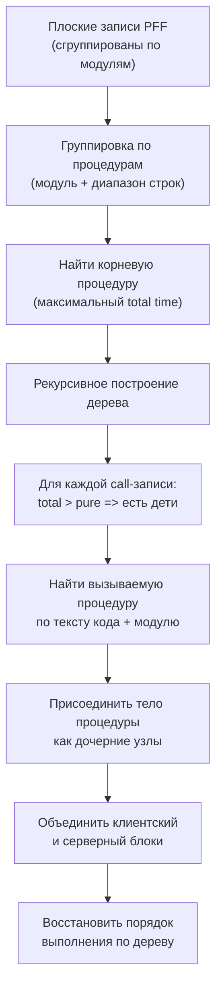

# План разработки парсера PFF v2.0

## Контекст и ключевые находки

Из анализа `reference.pff` и скриншота 1С выявлены критические проблемы текущего парсера:

1. **Нет иерархии вызовов** -- `_parse_block_events` в [pff_parser.py](src/pff_parser.py) присваивает `Level=0` всем событиям формата 2b. В реальности записи внутри блока PFF сгруппированы по модулям (а не в порядке выполнения), и 1С восстанавливает дерево вызовов по связи "вызывающая строка -> тело вызываемой процедуры".
2. **Записи не в порядке выполнения** -- в PFF сначала идут записи `ОбщийМодуль.Клиент`, потом `ОбщийМодуль.КлиентСервер`, потом `Обработка.Форма` (хотя выполнение начинается с формы). Парсер выдаёт их как есть.
3. **Два блока (Клиент + Сервер) не связаны** -- PFF содержит два сессионных блока (`Тонкий клиент: (3)` и `Сервер: (3)`), которые нужно объединять в единый поток по точкам перехода `C->S`.
4. **Теряются поля** -- GUID модуля, тип объекта (поле 4 в сигнатуре: 0=общий модуль, 1=серверная процедура формы, 3=клиентская процедура формы), тип расширения (поле 6: 4=Вместо), счётчик выполнений, полные проценты.

---

## Фаза 1: Спецификация исходного формата PFF

**Файл:** `docs/PFF_Format.md`

Задокументировать полную структуру `reference.pff` на основе сопоставления с кодом BSL и скриншотом 1С:

- **Корневой заголовок:** `{5, 2, RootGUID, ...}` -- версия формата, количество сессионных блоков, идентификатор замера
- **Сессионный блок:** `{10, "WS-HQ-43FAC", "", 1563, "", SessionType, "", ...}` -- хост, порт, тип сессии (32=тонкий клиент, 64=сервер), GUIDы информационной базы, номер сеанса
- **Блок записей:** `{0, RecordCount, BlockGUID, ...records...}` -- тип=0, количество записей, GUID блока
- **Сигнатура записи** (13 полей):

```
{{"",0}, ModuleGUID, ConfigGUID, ObjectType, ExtGUID, ExtMethodType, Base64, "ExtName"}
"Модуль.Имя", НомерСтроки, "КодТекст",
Количество, ВремяВсего_сек, ВремяЧистое_сек, ПроцентВсего, ПроцентЧистое,
ФлагКлиент, ФлагСервер, ФлагОбрСервером, BlockGUID
```

- **ObjectType:** 0=общий модуль, 1=серверная процедура формы/функция, 3=клиентская процедура формы
- **ExtMethodType:** 0=нет расширения, 4=Вместо(&Вместо)
- **Флаги контекста:** (1,0,0)=Клиент, (0,1,0)=Сервер, (1,0,1)=Клиент вызывает Сервер (Обр. сервером)
- **Связь total/pure:** для вызова процедуры `total - pure = sum(children.total)`, что позволяет восстановить иерархию

---

## Фаза 2: Алгоритм восстановления стека вызовов

**Файл:** `docs/CallStack_Algorithm.md`

Ключевая новая функциональность -- восстановление дерева вызовов из плоских записей PFF:




Алгоритм:

1. Разобрать все записи блока, сгруппировать по процедурам (модуль + непрерывный диапазон строк от начала до `КонецПроцедуры`/`КонецФункции`)
2. Для каждой записи-вызова (где `total - pure > epsilon`):
  - Определить вызываемый модуль из текста кода (например `Клиент.ВыполнитьКлиентскийКод()` -> `ОбщийМодуль.Клиент.Модуль`)
  - Или определить, что это вызов процедуры того же модуля (например `ВспомогательнаяПроцедура()` -> тот же модуль, другой диапазон строк)
  - Привязать тело вызываемой процедуры как дочерние узлы
3. Для `C->S` вызовов (например `ТестНаСервере()` с `total=96.9ms, pure=15.8ms`): дочерние узлы находятся в серверном блоке PFF
4. Восстановить хронологический порядок обходом дерева (DFS)

---

## Фаза 3: Спецификация целевого формата

**Файл:** `docs/Target_Format.md`

### Принцип: ноль потерь информации + токен-эффективность

Из каждой записи PFF сохраняется:

- Контекст выполнения (C/S/CS)
- Уровень вложенности (восстановленный)
- Модуль и строка
- Текст кода
- Счётчик выполнений (Nx)
- Время всего и чистое (мс)
- Расширение (если есть)
- Переходы между контекстами

### TRACE формат (полный хронологический лог)

Пример на основе `reference.pff`:

```
=== PFF TRACE ===
Замер: reference.pff | Сессии: ТонкийКлиент(3), Сервер(3) | Общее: 128.1ms

[C] L0 Обр.ОбработкаТест.Форма:29 | Сообщить("=== НАЧАЛО ТЕСТА PFF ===") 1x 2.86ms
[C] L0 :32 | Сообщить("1. Тест клиентского модуля") 1x 1.11ms  
[C] L0 :33 | Клиент.ВыполнитьКлиентскийКод() 1x T:10.63 P:7.82ms
[C]   L1 ОбщМод.Клиент:5 | Сообщить("Выполняется клиентский код") 1x 1.01ms
[C]   L1 :8 | Счетчик = 0 1x 0.00ms
[C]   L1 :9 | Для Индекс = 1 По 1000 Цикл 1001x 0.58ms
[C]   L1 :10 | Счетчик = Счетчик + 1 1000x 0.61ms
[C]   L1 :11 | КонецЦикла 1000x 0.60ms
[C]   L1 :12 | КонецПроцедуры 1x 0.00ms
[C] L0 :36 | Сообщить("2. Тест общего модуля") 1x 0.72ms
[C] L0 :37 | КлиентСервер.ОбщийКод() 1x T:3.61 P:3.33ms
[C]   L1 ОбщМод.КлиентСервер:8 | Результат = 0 1x 0.00ms
          ...вложенные строки...
[C]   L1 :14 | ВспомогательнаяПроцедура() 1x T:0.09 P:0.00ms
[C]     L2 :19 | Счетчик = 0 1x 0.00ms
          ...
[C] L0 :40 | Сообщить("3. Тест серверного модуля") 1x 0.81ms
[C→S] L0 :41 | ТестНаСервере() 1x T:96.90 P:15.85ms
[S]   L1 Расш:РасширениеТест Обр.ОбработкаТест.Форма:8 | Сообщить("Выполняется ТестНаСервере") 1x 0.02ms
[S]   L1 :11 | Сервер.ВыполнитьСерверныйКод() 1x T:9.25 P:0.02ms
[S]     L2 ОбщМод.Сервер:6 | Сообщить("Выполняется серверный код") 1x 0.01ms
          ...
```

Стратегии токен-эффективности:

- Модуль указывается только при смене (остальное `:Строка`)
- Сокращённые имена модулей (`ОбщМод.` вместо `ОбщийМодуль.`)
- `T:` и `P:` только когда total != pure (есть вложенные вызовы); иначе одно число
- Контекст `[C]`/`[S]`/`[C→S]` указывается только при смене
- Счётчик `Nx` опускается при N=1 (опционально)
- Расширение помечается коротко `Расш:ИмяРасширения`

### PERF формат (дерево производительности + hotspots)

Сохраняет ту же информацию, но агрегированно: дерево критического пути с порогом фильтрации, и отдельно топ "горячих точек" по чистому времени.

---

## Фаза 4: Реализация парсера v2.0

**Файл:** [src/pff_parser.py](src/pff_parser.py)

### 4.1 Улучшение `PFFStreamParser`

- Извлекать из сигнатуры записи: `ModuleGUID`, `ObjectType`, `ExtMethodType`, `ExtensionName`
- Сохранять счётчик выполнений (`Count`) в каждом событии
- Парсить заголовок сессионного блока (тип сессии, хост, порт)

### 4.2 Новый модуль `CallTreeBuilder`

- Принимает плоский список записей из одного или двух блоков
- Группирует записи по процедурам (модуль + диапазон строк)
- Строит дерево вызовов рекурсивно
- Объединяет клиентский и серверный блоки через точки `C->S`
- Выдаёт события в хронологическом порядке с корректным `Level`

### 4.3 Обновление `ReportGenerator`

- Использовать данные из `CallTreeBuilder` вместо плоских записей
- Реализовать новый формат TRACE (сокращённые модули, T:/P:, пропуск при смене)
- Обновить PERF с учётом реальной иерархии
- Добавить заголовок с метаданными сессий
- Сохранить обратную совместимость с текущим форматом (опция `--legacy`)

### 4.4 Обновление GUI

- Добавить отображение метаданных сессий (тип клиента, хост, порт)
- Добавить опцию "Показывать счётчики выполнений"
- Обновить промпт для модели с новым форматом

---

## Фаза 5: Тестирование и валидация

- Прогнать `reference.pff` через новый парсер
- Сверить дерево вызовов со скриншотом 1С (особенно: раскрытие узлов с ► стрелками, значения Кол., Время, флаги контекста)
- Проверить, что все записи PFF представлены в выходе (ноль потерь)
- Сравнить объём токенов нового формата vs старого
- Написать pytest-тесты с assertion на ключевые значения из reference.pff

