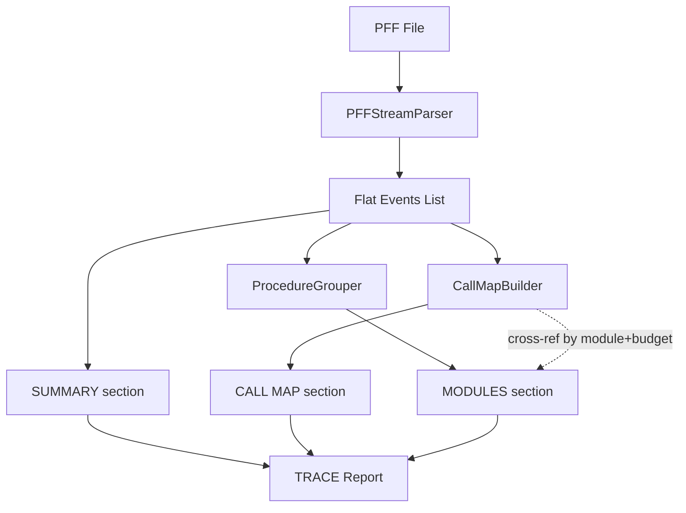

# Рефакторинг формата TRACE v3

## Контекст

Текущий `CallTreeBuilder` ненадежен на реальных замерах (хардкод паттернов кода, неоднозначность сопоставления по времени). Переходим к стратегии "умной группировки": вместо программного построения дерева мы предоставляем данные в структурированном формате, удобном для LLM.

В PFF файлах **нет строк объявления** процедур/функций (`Процедура Имя()`). Есть только маркеры конца (`КонецПроцедуры`/`КонецФункции`). Для идентификации процедурных блоков используем диапазоны строк + тип из маркера конца.

## Архитектура нового формата TRACE




## Новый формат TRACE (пример)

```
=== SUMMARY ===
Events: 1361 | Blocks: 1 | Total: 1.57s
Context: Server

=== CALL MAP ===
Строки, где Total >> Pure (есть вложенные вызовы).
Budget = Total - Pure (время, потраченное на вызовы из этой строки).

#1 [S] ВнешниеКомпонентыСлужебный:793 | Budget: 60.7ms
   Информация = ...СлужебныйВызовСервера.ИнформацияОСохраненнойКомпоненте(...)
   -> see: ВнешниеКомпонентыСлужебныйВызовСервера Func(lines 45-89) [Total: 59.8ms]

#2 [S] ВнешниеКомпонентыСлужебный:774 | Budget: 4.14ms
   ПараметрыПодключения = ВнешниеКомпонентыСервер.ПараметрыПодключения()
   -> see: ВнешниеКомпонентыСервер Func(lines 200-215) [Total: 4.10ms]

=== MODULES ===

--- ОбщийМодуль.ВнешниеКомпонентыСлужебный.Модуль ---

  [S] Func (lines 44-51) Total: 0.20ms Pure: 0.02ms
    :44 | Если ОбщегоНазначения.ПодсистемаСуществует(...)   0.026  0.007
    :45 | МодульПолучение = ОбщегоНазначения.ОбщийМодуль(...)  0.132  0.008
    :46 | Возврат ...ДоступнаЗагрузкаВнешнихКомпонент()     0.037  0.007
    :51 | КонецФункции                                       0.001  0.001

  [S] Func (lines 773-811) Total: 67.15ms Pure: 6.16ms
    :773 | Если ПараметрыПодключения = Неопределено Тогда   0.001  0.001
    :774 | ПараметрыПодключения = ...ПараметрыПодключения() 4.166  4.144
    ...
    :811 | КонецФункции                                      0.001  0.001
```

## Изменения в файлах

### 1. [src/pff_parser.py](src/pff_parser.py) -- основная работа

**Удалить:**

- Класс `CallTreeBuilder` (lines 559-837)
- Параметр `highlight_extensions` из `process_pff()`, `ReportGenerator.__init__()`, аргументов CLI
- Вызов `CallTreeBuilder` в `process_pff()` (lines 1233-1235)
- Все проверки `self.highlight_extensions` в `ReportGenerator`

**Добавить новый класс `ProcedureGrouper`:**

- Принимает список событий
- Группирует события по ключу `(Module, Context, Extension)`
- Внутри каждой группы разбивает на "процедурные блоки" по маркерам `КонецПроцедуры`/`КонецФункции`
- Определяет тип блока: `Func`/`Proc` по маркеру конца; `Block` если маркер не найден
- Вычисляет `Total` и `Pure` суммы для каждого блока
- Возвращает структуру: `[{module, context, extension, blocks: [{type, line_start, line_end, total, pure, events}]}]`

**Добавить новый класс `CallMapBuilder`:**

- Принимает список событий + результат `ProcedureGrouper`
- Находит строки где `Total - Pure > threshold` (порог: 0.5ms или 1% от общего времени)
- Для каждой такой строки:
  - Извлекает имя вызываемого модуля из кода (простой regex: `ИмяМодуля.Метод(`)
  - Ищет среди групп MODULES блок с подходящим модулем + подходящим Total (budget +/- 20%)
  - Если найден -- формирует cross-reference `-> see: Module Func(lines X-Y) [Total: Nms]`
  - Если не найден или неоднозначно -- не добавляет ссылку (модель разберется сама)

**Переписать `ReportGenerator.generate_trace()`:**

- Вместо хронологического лога с Level -- вывод трех секций: SUMMARY, CALL MAP, MODULES
- Расширения всегда выделяются `[Ext:Name]` (без опции)

**Обновить `TRACE_MODEL_PROMPT`:**

- Объяснить формат MODULES: группировка по модулю+контексту, блоки `Func/Proc (lines X-Y)`
- Объяснить CALL MAP: Budget = Total - Pure; ссылки `-> see:` -- подсказки, не гарантия
- Объяснить что имен процедур в PFF нет, но `Func/Proc (lines X-Y)` позволяет идентифицировать блоки
- Объяснить что `[S]`/`[C]` в заголовке группы означает контекст всех строк в группе
- Объяснить как использовать CALL MAP + MODULES для восстановления цепочки вызовов

### 2. [src/pff_parser_gui.py](src/pff_parser_gui.py) -- исправление GUI

**Исправить layout (баг: кнопка "Сформировать" не видна):**

- `result_header` (row=12) -- заголовок + кнопка
- `table_frame` (row=**13**) -- текстовое поле (сейчас row=12, перекрывает кнопку)
- `out_frame` (row=**14**) -- панель выходного файла (сейчас row=13)
- `main.rowconfigure(13, weight=1)` -- растягивать текстовое поле, не заголовок
- `main.rowconfigure(12, weight=0)` -- заголовок фиксированной высоты

**Удалить:**

- `var_highlight_extensions`, `check_highlight_ext` (row=9)
- Параметр `highlight_extensions` из вызова `process_pff()` в `run_parser()`
- Сдвинуть чекбоксы ниже (compact -> row=9, model_prompt -> row=10)
- Обновить `result_header` -> row=11, `table_frame` -> row=12, `out_frame` -> row=13
- `main.rowconfigure(12, weight=1)`

### 3. Документация

**Переписать [docs/Target_Format.md](docs/Target_Format.md):**

- Описать новый формат TRACE (SUMMARY + CALL MAP + MODULES)
- Убрать описание хронологического лога и дерева PERF (PERF будет описан отдельно)

**Удалить или заменить [docs/CallStack_Algorithm.md](docs/CallStack_Algorithm.md):**

- Содержит описание отвергнутого алгоритма
- Заменить на краткое описание стратегии "умной группировки" и CALL MAP

**Уточнить [docs/PFF_Format.md](docs/PFF_Format.md):**

- Добавить примечание: строки `Процедура`/`Функция` не попадают в замер (только `КонецПроцедуры`/`КонецФункции`)

### 4. Тестирование

Прогнать на трех файлах и проверить корректность:

- `tests/reference.pff` -- эталон с расширениями и клиент-серверными вызовами
- `tests/Проверка расчета хэша.pff` -- сложный реальный замер (1361 запись)
- `tests/Хэш при подписании.pff` -- проблемный замер для сравнительного анализа

